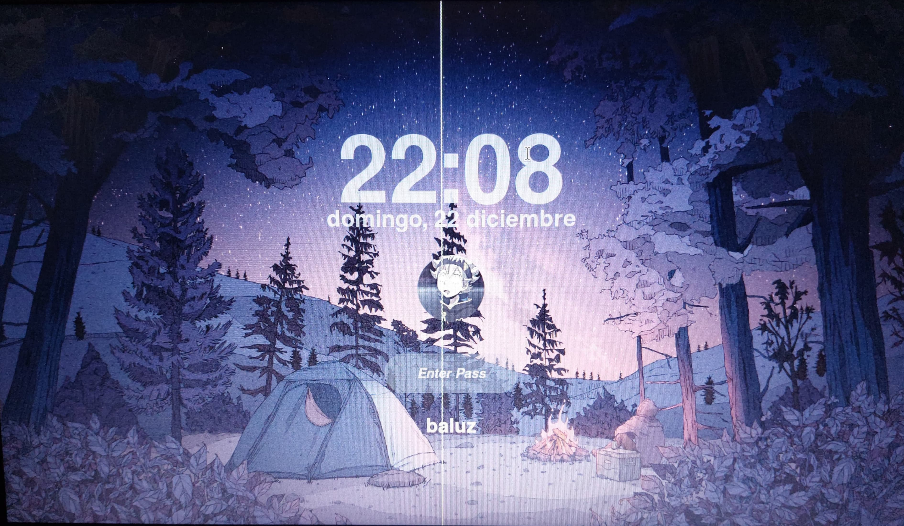

# arch-linux-config
This is my personal arch linux setup

#Dotfiles 

**Dotfiles** is my configuration files for a Linux enviorment. This repository includes configurations for tools like hyprland, kitty, waybar, neovim and fastfetch.

## Review of Arch

  
  

<table>
  <tr>
    <td></td>
    <td></td>
  </tr>
  <tr>
    <td></td>
    <td></td>
  </tr>
  <tr>
    <td></td>
    <td></td>
  </tr>
</table>

## Table of Contents

