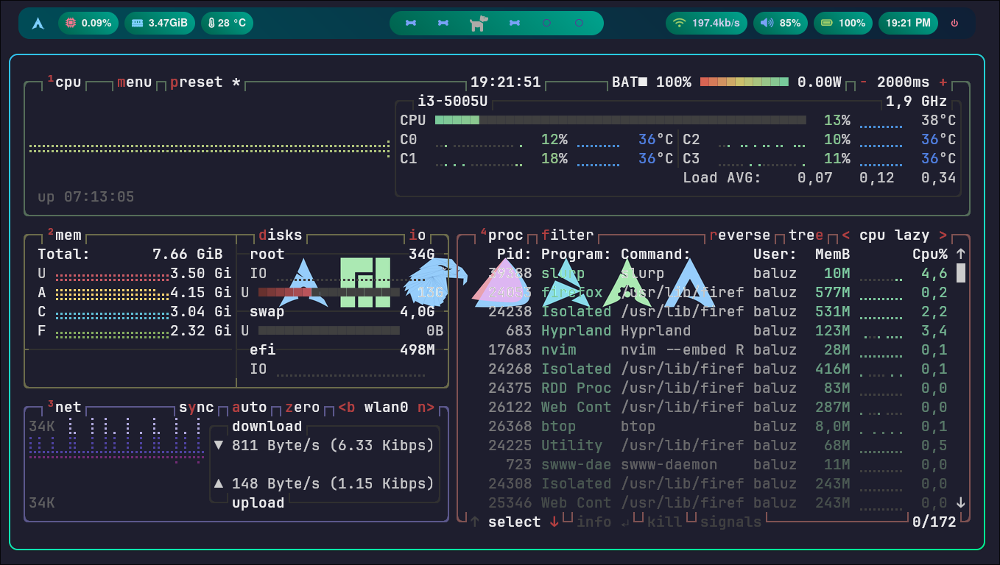
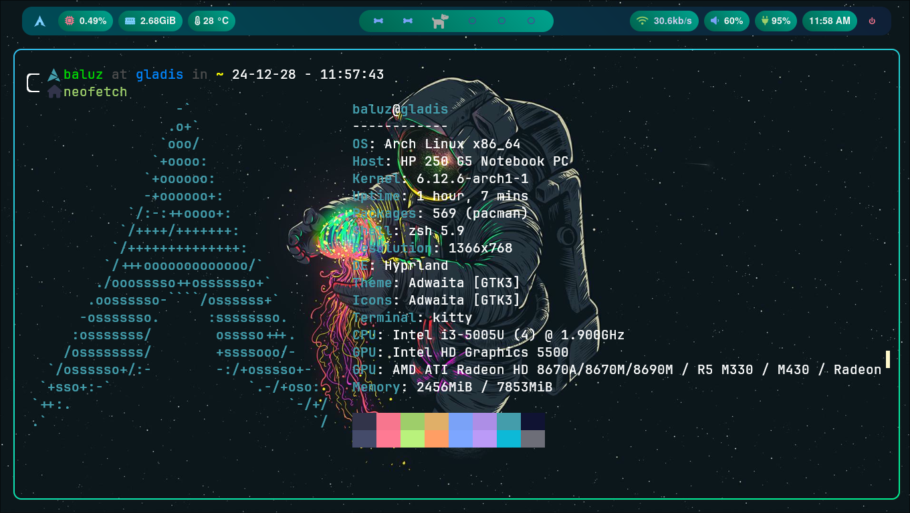

# arch-linux-config 
This is my personal arch linux setup

# Dotfiles 

**Dotfiles** is my configuration files for a Linux enviorment. This repository includes configurations for tools like hyprland, kitty, waybar, neovim and fastfetch.

## Review of Arch


## Review of Arch

|  |  |
|---|---|
|  |  |
|  |  |

## Introduction
**Introduction**: This configuration of arch-linux is a configutation that use **hyprland** like window gestor, **kitty** like a terminal, **neovim** like a editor of text and code personalized, **waybar** is a GTK status bar that can be customized, **zsh** like a principal bash, and **fastfetch** like CLI system information tool written in BASH, thats configuration is simple and easy to use.

## Installation
For the **installation**, the steps I followed were, at the end of installing arch linux, install git, hyprland, firefox, to be able to start the configuration, later, I started with bash, installing zsh and using it as the main bash.

1. Install neovim, git, hyprland

    ```bash
    sudo pacman -S neovim git hyprland
    ```
2. Install zsh, para que sea nuestro bash principal
    ```bash
    sudo pacman -S zsh
    ```
    if you can't install zsh, you can clone the repository from their github.

3. Install Yay
    ```bash
    sudo pacman -S curl base base-devel --noconfirm
    ```
    Clone the yay github, and enter the folder yay
    ```bash
    cd yay
    ```
    ```bash
    makepkg -si
    ```
4. Download NerdFonts
    ```bash 
    cd .local
    ```
    ```bash
    cd share
    ```
    and unzip the downloaded file 
5. Install Kitty
    ```bash 
    sudo pacman -S kitty
    ```
6. Install Waybar 
    ```bash
    sudo pacman -S waybar
    ```
7. Install Neofetch
    ```bash
    sudo pacman -S neofetch
    ```
8. Install Fastfetch
    ```bash
    sudo pacman -S fastfetch
    ```
9. Install Waybar
    ```bash
    sudo pacman -S waybar
    ```
10. Install Ranger 
    ```bash 
    sudo pacman -S ranger
    ```

