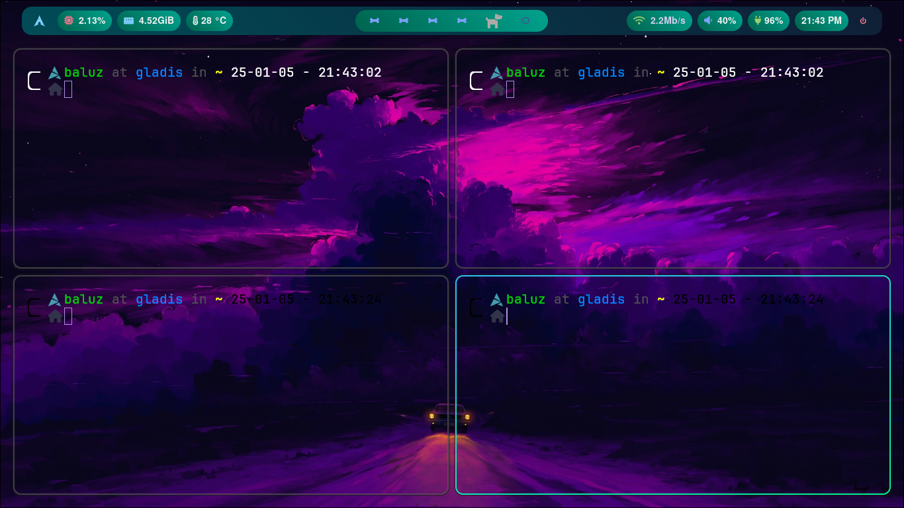
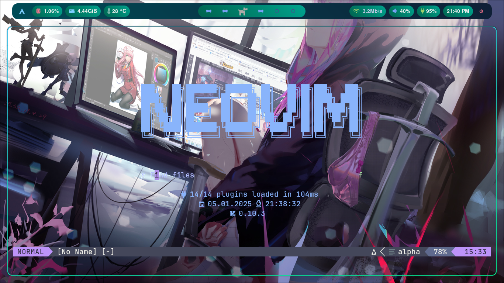

# arch-linux-config
This is my personal arch linux setup

#Dotfiles 

**Dotfiles** is my configuration files for a Linux enviorment. This repository includes configurations for tools like hyprland, kitty, waybar, neovim and fastfetch.

## Review of Arch

## Review of Arch

|  |  |
|---|---|
|  |  |
|  |  |

## Table of Contents

